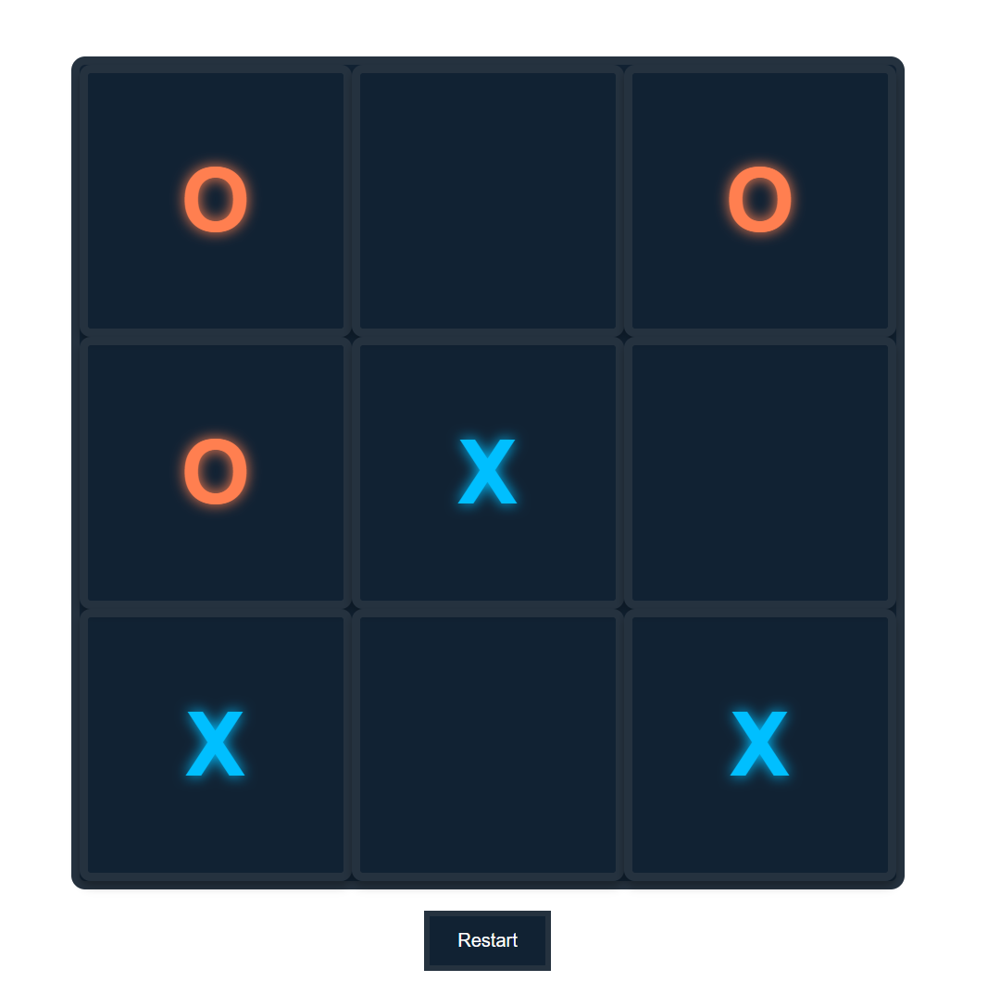

# ❌⭕ Tic-Tac-Toe Game

A simple and elegant **Tic-Tac-Toe** game built using **React**. Play as Player X or Player O in this two-player browser-based game with responsive layout and smooth game state handling.

---

## 🔗 Live Demo

👉 [**Play the Game**](https://to-do-list-saipavan214s-projects.vercel.app/)

---

## 🎮 Features

- 🧠 Classic 3x3 grid Tic-Tac-Toe gameplay
- 🧑‍🤝‍🧑 Two-player local play (X vs O)
- 🔁 Game reset button
- 🏆 Winner announcement
- ❌ Draw detection
- 🖥️ Responsive layout with a clean UI

---

## 🖼️ Screenshots

| Game Board          | Win State              |
| ------------------- | ---------------------- |
|  |  |

---

## ⚙️ Tech Stack

| Technology | Description                |
| ---------- | -------------------------- |
| React      | JavaScript library for UI  |
| CSS        | For styling the game board |
| Vercel     | For deploying the app live |

---

## 🚀 Getting Started

Clone and run this project locally:

```bash
# 1. Clone the repository
git clone https://github.com/SaiPavan214/Tic-Tac-Toe-Game.git

# 2. Navigate to the project folder
cd Tic-Tac-Toe-Game

# 3. Install dependencies
npm install

# 4. Run the development server
npm run dev
Make sure you have Node.js and npm installed on your machine.

📁 Project Structure
csharp
Copy
Edit
Tic-Tac-Toe-Game/
│
├── src/
│   ├── App.jsx             # Main game logic
│   ├── components/
│   │   └── Square.jsx      # Game square component
│   └── index.css           # Styles
│
├── public/
│   └── index.html
├── package.json
├── vite.config.js
└── README.md
🧠 Game Logic Highlights
The game board is stored in a state array


Turn alternates between 'X' and 'O'

Checks for win conditions after every move

Disables grid once game is over (win or draw)

Resets all states on clicking "Restart Game"

📌 Future Improvements
🤖 Add single-player mode vs computer (AI)

🌈 Add animations and sounds

🔄 Save match history or scoreboard

🌗 Dark mode support

🙋‍♂️ Author
Sai Pavan
📎 GitHub Profile
🌐 Live Demo

```
